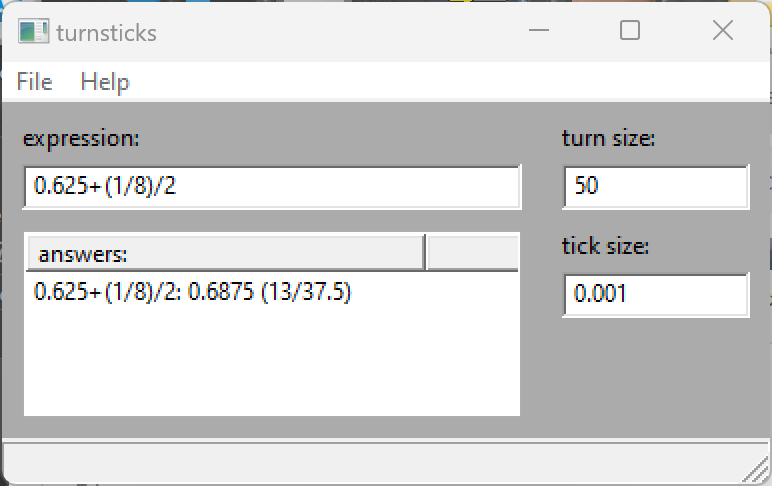

# turnsticks
Machining tool for calculating lathe/mill handwheel turns and ticks to reach a dimension.

## Overview
Machining requires precise measurements of cuts.  Manually, this involves rotating the handwheels that move the cutter or work in the X, Y, and/or Z axes; the handwheels typically have gradation scales that correspond to a specific distance of movement.  Movement with the handwheels is counted in terms of "turns", or complete rotation of the handwheel, and "ticks", the number of gradation increments.  This doesn't apply to computer numerical control (CNC)-equipped machines, where the cut/workpiece movement is controlled by a script.

So, converting a dimension to the "turns/ticks" required to traverse it is a bit tedious.  That's the purpose of turnsticks, to automatically calculate such.  Essentially, a dimension is entered in the equation box, the Enter key is tapped, and the program posts an entry with the dimension and the corresponding turns and ticks.  The dimension can also be specified as an equation, e.g., "0.625-(1/8)/2", to accommodate things like adjustments for the diameter of the cutting tool, in the example "1/8" is the diameter of an endmill, divided by 2 to get the radius, then subtracted from the numeric dimension.  Here's a screenshot:

The program interface includes entries to calibrate the program to a particular machine.  'tick size' specifies the dimension of a single tick, and 'turn size' specifies the number of ticks in one complete revolution of the handwheel.  The program is presently hard-coded to default to 0.001" and 50 respectively, corresponding to the Sherline machining tools I currently own.

The notation convention for a dimension is "n.nnn (turns/ticks)".

## Building

The only prerequisite software is wxWidgets, a cross-platform GUI library.  For Debian/Ubuntu:

    $ sudo apt install libwxgtk3.0-gtk3-dev

After the prerequisite is met, the easiest way to get the code is to clone this repository:

    $ git clone https://github.com/butcherg/turnsticks.git

then doing the following:

    $ cd turnsticks
    $ mkdir build
    $ cd build
    $ cmake ..
    $ make

This will make an executable in the build directory you can run like this:

    $ ./turnsticks

For Windows, I recommend installing the MSYS2 environment to do this, emulates a bash shell and provides a full package library in Windows.

## License

The source code and text of this repository is copyrighted 2023 by Glenn Butcher, all rights reserved.  Accordingly, I license it for use under the terms and conditions of the GPL 3.0 license, see the LICENSE file in the repo.

